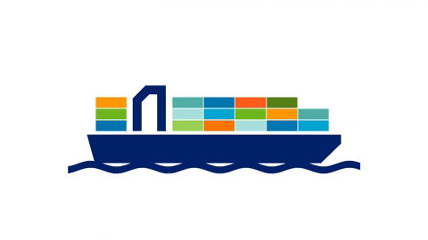
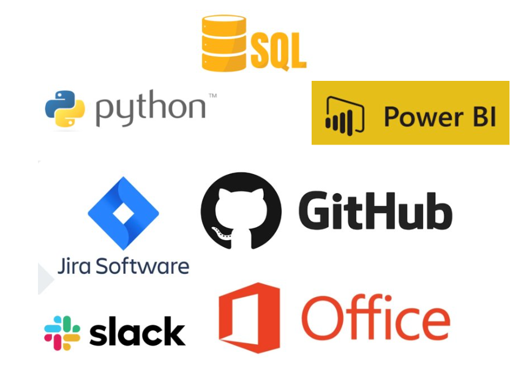

# API-4 - Análise de Eficiência de Terminais Portuários no Brasil

 

 
       

# Índice
* [Projeto](#projeto-api)
* [Objetivo do Projeto](#objetivo-do-projeto)
* [Resultados Esperados](#resultados-esperados)
* [Equipe](#equipe)
* [Cronograma das Sprints](#cronograma-das-sprints)
* [Backlog do Produto](#backlog-do-produto)
* [Tecnologias utilizadas](#tecnologias-utilizadas)
* [Competências Desenvolvidas](#competências-desenvolvidas)

# Projeto (API) 
O projeto, fundamentado na metodologia Ágil Scrum, visa realizar a or Análise de Eficiência de Terminais Portuários no Brasil, com o objetivo de aprimorar a distribuição e, assim, diminuir os custos logísticos.

      
# Objetivo do Projeto
O projeto "Análise de Eficiência de Terminais Portuários no Brasil" tem como objetivo principal fornecer uma visão clara e objetiva sobre a produtividade e o desempenho dos terminais portuários. A proposta é desenvolver uma solução que permita aos clientes comparar a eficiência dos terminais, identificar quais apresentam maiores tempos de espera e compreender os principais fatores que impactam as paradas portuárias, considerando, por exemplo, períodos específicos do ano. Além disso, o projeto busca disponibilizar informações sobre as principais cargas transportadas em cada terminal, analisando se há padrões ou motivos específicos para a predominância de determinados tipos de carga. Outro aspecto relevante é a identificação dos portos que movimentam o maior volume de transporte, permitindo uma visão mais estratégica do setor

# Resultados Esperados
Os resultados esperados do projeto "Análise de Eficiência de Terminais Portuários no Brasil" incluem a criação de uma ferramenta analítica que possibilite uma avaliação mais precisa da eficiência dos terminais portuários. Espera-se que essa solução permita aos usuários visualizar comparações objetivas entre os terminais, identificando quais apresentam maior produtividade e quais enfrentam problemas, como altos tempos de espera.

Além disso, o projeto deve fornecer insights sobre os principais motivos das paradas portuárias, permitindo uma melhor compreensão dos fatores que impactam a operação, como sazonalidade e demandas específicas. Também se espera que os usuários consigam analisar os tipos de cargas movimentadas em cada terminal e identificar padrões logísticos que possam influenciar a tomada de decisões estratégicas.
# Equipe

# Organograma
| Função        | Foto                                          | LinkedIn                                        | GitHub                                         |
|---------------|-----------------------------------------------|------------------------------------------------|------------------------------------------------|
| Product Owner (João Silva) | |  |           |
| Scrum Master (Laura Silva)     |    |   |         |
| Team Member (Yasmin Fernandes) |  |   |          |
| Team Member (Felipe Rocha)     |    | |           |
| Team Member (Ingrid Gonçalves)|  |   |          |
| Team Member (Miriã Chaves)    |    |  |         |
| Team Member (Lucca Silva)     |    |  |           |
| Team Member (Anderson Carvalho)     |    |  |           |

# Cronograma das Sprints

Sprint | Previsão | Status| Histórico| 
|------|--------|------|--------|
|Kick Off | 14/03/2025 | Concluído | [Ver Relatório]() | 
|01| 04/04/2025|  iniciado |[Ver Relatório]() | 
|02| 25/04/2025| Não iniciado|[Ver Relatório]() | 
|03| 16/05/2025 | Não iniciado |[Ver Relatório]()  | 
|Feira de Soluções| 29/05/2025 | Não iniciado|[Ver Relatório]()  | 
|04| 27/06/2025 | Não iniciado |[Ver Relatório]()  

# Backlog do produto
- [ ] Desenvolvimento de um comparativo objetivo da produtividade entre os terminais portuários.
- [ ] Identificação dos terminais portuários com maior tempo de espera.
- [ ] Análise dos principais motivos das paradas portuárias e sua relação com fatores específicos, como períodos sazonais.
- [ ] Visualização das principais cargas transportadas por terminal portuário e análise dos fatores que influenciam sua predominância.
- [ ] Identificação dos portos com maior volume de carga transportada.

# Funcionalidades e registros das sprints

Apresentação das funcionalidades
Confira a seguir uma demonstraão das funcionalidades para cada tipo de usuário do sistema:

## Tecnologias Utilizadas

 

 
       

## Sprint 1. Desenvolvimento do Projeto

 - [x] Análise de Dados concedidos para o desenvolvimento do produto
 - [x] Estruturação do GitHub
 - [x] Captura de dados;
- [x] Tratamentos dos dados capturados.

## Sprint 2. Implementação

 - [ ] Análise dos dados de atracação
 - [ ] Aplicação da Linguagem Phyton e R para o desenvolvimento do produto 
 - [ ] Visualização dos dados no Power BI
      
## Sprint 3 . Operacialização
 - [ ] Principais portos em termos de quantidade transportada
 - [ ] Visualização de Produtividade entre Portos e Terminais
 - [ ] Identificar terminais portuários que apresentam o maior tempo de espera

 ## Sprint 4 . Finalização
 - [ ] Principais portos em termos de quantidade transportada
 - [ ] Indentificar principais motivos das paradas portuárias
 - [ ] Principais cargas transportadas por cada terminal

  
# Competências desenvolvidas

## Hard Skill (saber tecnológico)

Hard Skills desenvolvidas

  
| Tecnologia/Metodologia | Classificação |
| ---------------------- | ------------- |
| GitHub | ★ ★ ★ ★ ★ ★ ★ ☆ ☆ ☆ |
| Gestão de Projetos | ★ ★ ★ ★ ★ ★ ☆ ☆ ☆ ☆ |
| Scrum Master | ★ ★ ★ ★ ★ ★ ★ ☆ ☆ ☆ |
| Prodct Owner | ★ ★ ★ ★ ★ ★ ★ ☆ ☆ ☆ |
| Markdown | ★ ★ ★ ★ ★ ★ ★ ☆ ☆ ☆ |
| Power BI | ★ ★ ★ ★ ★ ★ ★ ☆ ☆ ☆ |
| Python | ★ ★ ★ ★ ★ ★ ★ ☆ ☆ ☆ |

 

## Soft Skill (saber comportamental)

Soft Skills desenvolvidas

| Habilidades | Classificação |
| ---------------------- | ------------- |
| Colaboração | ★ ★ ★ ★ ★ ☆ ☆ ☆ ☆ ☆ |
| Proatividade| ★ ★ ★ ★ ★ ★ ☆ ☆ ☆ ☆ |
| Pensamento Crítico | ★ ★ ★ ★ ★ ★ ★ ☆ ☆ ☆ |
| Gerenciamento de Tempo | ★ ★ ★ ★ ★ ★ ★ ☆ ☆ ☆ |
| Adaptabilidade | ★ ★ ★ ★ ★ ★ ★ ☆ ☆ ☆ |
| Resiliência | ★ ★ ★ ★ ★ ★ ★ ☆ ☆ ☆ |

